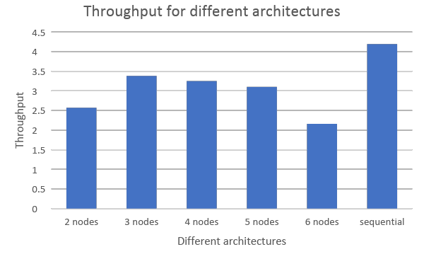

# Distributed Deep Learning Inference for Trajectory Prediction

## Introduction

The field of deep learning has experienced significant progress in recent years, resulting in the creation of expansive neural network models that achieve state-of-the-art performance across diverse tasks. However, the inference phase of these models frequently presents computational challenges due to their intricate nature and large size. Consequently, distributed deep learning inference systems have emerged as a viable solution to expedite the inference process by harnessing parallelization and distributed computing techniques.

This project aims to design and implement a distributed deep-learning inference system that addresses the computational challenges associated with large-scale models. The system adopts a pipelined architecture, which decentralizes the processing across multiple computing nodes or devices. By distributing the workload, the system can leverage the collective computational resources of these nodes, resulting in faster and more efficient inference.

To accomplish this, the project will employ a model partitioning technique. The neural network model will be divided into smaller sub-models, with each sub-model assigned to a different computing node within the distributed system. This partitioning enables parallel execution of inference tasks on multiple sub-models, leading to improved inference throughput, energy consumption, and overhead.

Additionally, the system will utilize socket communication, a mechanism for inter-process communication over a network, to facilitate efficient communication and coordination between the distributed nodes. Socket communication allows for seamless exchange of intermediate results and synchronization of inference progress across the distributed system.

By combining a decentralized architecture, model partitioning, and socket communication, the project seeks to create a powerful distributed deep learning inference system capable of accelerating the inference process for large-scale neural network models. This system has the potential to significantly reduce the computational burden and improve the efficiency of deep learning inference tasks, opening up new possibilities for real-time and resource-constrained applications.

## Use Case and Model

Predicting future trajectories of objects is critical for the safety and efficiency of various applications. Autonomous vehicles require accurate trajectory predictions to make informed decisions about their movements, and air traffic control needs to predict the movements of planes to ensure safety and reduce congestion. In addition, drone delivery services rely on trajectory predictions to ensure timely and efficient deliveries. Therefore, building a distributed machine learning inference system for real-time trajectory predictions is crucial for the success of these applications. Moreover, such an application is associated with a large input of real-time geo-encoded data. This creates the need to maximize the throughput of the model for it to be able to predict more locations per unit of time.

To achieve the goal of building a distributed machine learning inference system for real-time trajectory predictions, we will use a GRU machine learning model with 21 layers and a distributed system to leverage the performance of the pre-trained model. This trained model discerns Daejeon’s traffic patterns using input from taxi data. It predicts the next trajectory based on the previously visited locations. The layers of this sequential model are partitioned and distributed across different worker nodes. The distributed system will provide the same accuracy as it is executing the same mathematical operations and should have an increased throughput.

## Project Design: Architecture and implementation
Three main tasks were necessary to the realization of the project

  

Fig. 1: CORE Emulator

### Model Partitioning

The execution of prediction in a model necessitates the same underlying mathematical operations regardless of the approach used. However, in the proposed distributed deep learning inference system, the original model's multiple layers are partitioned and distributed across multiple compute nodes. This partitioning process is facilitated using the capabilities of Keras, a popular deep-learning framework in Python.

To achieve efficient model partitioning, various partitioning architectures have been proposed and carefully evaluated. These architectures explore different strategies to divide the model into submodels, with each sub-model being allocated to a specific compute node within the distributed system. The partitioning choices take into account factors such as the computational complexity of individual layers, the communication overhead between nodes, and the balance of workload distribution among the nodes.

We are partitioning the neural network into multiple sub-models so it has reduced complexity by not including a strategy for assigning layers based on the computational complexity and memory requirements of each compute node. This project assumes that every worker node or an edge device is similar and the layers are distributed evenly across every node.

The specific partitioning architectures employed in the system will be elaborated upon in the results section of this work. The results section will provide an in-depth analysis and evaluation of the chosen partitioning strategies, explaining the rationale behind the selections made. This analysis will shed light on the effectiveness of the partitioning approaches in terms of inference performance, scalability, and resource utilization.

By leveraging the capabilities of Keras and carefully selecting appropriate partitioning architectures, the proposed distributed deep learning inference system aims to effectively distribute the computational workload across multiple compute nodes. This distributed approach allows for parallel processing and harnessing the collective power of the distributed system, ultimately accelerating the overall inference process for large-scale neural network models

### Nodes Configuration

To establish the different nodes and their relative communication, an emulation environment was needed. Core Emulator allows the simulation of a node network configuration in a fast and reliable way. These nodes will be needed to host the computation of the submodel and communicate the needed parameters for the next node. Two types of nodes are presented here:

**Master Node**

The master node establishes connections with two TCP Sockets for every compute node. Through one TCP Socket, it transmits a serialized version of the model's architecture along with the IP address of the subsequent node in the inference chain. The other TCP Socket is responsible for sending a serialized array containing the model's weights. On the receiving end of the compute node, the model socket remains in a waiting state until it receives the model's weights through the other socket. Once the weights are received, the compute node instantiates a complete TensorFlow model, incorporating the correct architecture and weights.

**Worker Node**

Each worker node establishes a TCP socket connection to its designated next node on a separate thread. This connection serves the purpose of transmitting intermediate inference results to the subsequent node in the inference chain. Consequently, each node is equipped with an incoming socket data connection from the previous node and an outgoing connection to the succeeding node. The output of the overall inference will be communicated from the last worker node to the master node.

### Inference Distribution

After distributing model partitions across compute nodes, the master initiates the data transmission to the first worker node in the chain. When the incoming socket of a node receives data, it undergoes de-serialization and compression. The node then feeds the previous inference result into its model, performs the necessary computations, and obtains a result. This result is subsequently serialized, compressed, and sent through the outgoing socket. This process repeats for each compute node.

The sockets handle the inference calculations in a sequential "first-in-first-out" manner, ensuring that prior inference data is sent to the next node before subsequent data. This sequencing is crucial to maintain the order in which inference results are returned to the dispatcher node. By allowing a compute node to process new inference data after completing a prior calculation, rather than waiting for the entire model to finish inference, the system should achieve higher throughput in terms of inference processing.

## Key Design Choices to Tackle Distributed System Challenges

**Heterogeneity**

In our project, heterogeneity is not the main issue. The reason is that our systems are self-contained, meaning they have consistent hardware configurations and computational capabilities. Therefore, there is no significant variation in terms of processing power, memory capacity, or network bandwidth among the worker nodes. As a result, the code does not include explicit mechanisms to address heterogeneity since it is not a relevant concern for our specific deployment scenario.

**Openness**

The architecture of our project is cleanly modularized into multiple sub-components using an Object-Oriented programming style, which makes it easy to extend each sub-component individually. Each Python file in the codebase represents each sub-component.

**Security**

Security concerns such as data privacy, authentication, or secure communication channels were not addressed because there was little value in doing so as our data is not confidential. Perhaps if we were dealing with confidential data, the connection between master and worker nodes could require some form of authentication. To ensure confidentiality, RSA could be used after the compression/decompression stage of data transfer.

**Failure Handling**

Although not explicitly implemented in the provided code, the use of socket-based communication allows for potential failure handling through error handling and exception mechanisms. However, our system will not work in the event a node fails completely, which is very possible if our system is scaled. A different way of dynamically partitioning the model needs to be used.

**Concurrency**

The project utilizes multiple compute nodes to speed up inference. Each compute node contains a sub-model that performs part of the inference, before passing the data to the next compute node. Also, the code utilizes multi-threading to enable concurrent execution of tasks, such as model inference and result printing. Queues are used as an additional data structure to store inputs/outputs between each compute node so that the threads are non-blocking (asynchronous).

**Quality of Service**

The code does not incorporate mechanisms to prioritize or manage the quality of service requirements for different tasks or nodes. In the future, we would require a way to monitor the load of a compute node to ensure that it is not overwhelmed, to prevent possible node failures.

**Scalability**

The code does not include features for dynamically scaling the system based on workload or the addition/removal of worker nodes. Currently, the master needs to know beforehand the number of nodes present to partition the sub-model before the inference phase begins, so the number of nodes cannot be changed once the inference starts.

**Transparency**

No input from the user is needed for the well functioning of the master and worker nodes. The nodes layer is hidden from the user and we therefore consider our system transparent. The only user input needed is the initial model, data input, and a number of nodes. This shields the user from the underlying complexities of the program, which include partitioning of the model, the node configurations, data compression/decompression, and the inference itself.

## Results and Discussion

**Energy Consumption:** It is the energy consumed for serialization and deserialization overhead. This is done by assuming that every bit requires 10 Pico Joule for it to be compressed or decompressed. It is measured in Joules (J).
Deserialization and Serialization Overhead: They represent how much time is taken to compress and decompress data when sending from one node to another anode. It is measured in Seconds(s).

**Network Payload:** It represents the amount of data that was transferred over the network. It is measured in Megabytes (MB).

**Inference Time:** It represents how much time was spent just on the inference. It is measured in Seconds (s).

**Communication Overhead:** It represents how much time is taken from one node to another. By observing the communication overhead times, we can see that the master to the first node and final node to the master communication are the costliest processes. It is measured in Seconds(s).

**Latency:** It is the combination of serialization, deserialization, and communication overhead. It explains the time utilized other than the usable or inference time and is measured in Seconds (s).

**Inference Throughput:** It is defined as the number of inferences made per unit of second. It is calculated by dividing the number of inferences made by the total time to predict the outputs. The following are the inference throughputs obtained for different architectures.

| Architecture: 3 nodes | Energy consumption (J) | (de)serialization Overhead (s) | Network payload (Mb) | Inference Time (s) | Communication overhead (s) |  Latency (s) |
|-----------------------|------------------------|--------------------------------|----------------------|--------------------|----------------------------|--------------|
| Dispatcher            | 4.70E-05               | 18.1                           | 573.79               |                    | 50.71                      | 68.81        |
| Node 1                | 2.45E-06               | 0.12                           | 29.85                | 37.2               | 31.49                      | 31.61        |
| Node 2                | 4.10E-07               | 0.219                          | 5                    | 30.81              | 37.781                     | 38           |
| Node 3                | 1.36E-06               | 42.91                          | 16.57                | 24.96              | 0.94                       | 43.85        |
| Total                 | 5.12E-05               | 61.349                         | 625.21               | 92.97              | 120.921                    | 182.27       |

Table 1. 3-Node Architecture Evaluation

| Architecture: 4 nodes | Energy consumption (J) | (de)serialization Overhead (s) | Network payload (Mb) | Inference Time (s) | Communication overhead (s) |  Latency (s) |
|-----------------------|------------------------|--------------------------------|----------------------|--------------------|----------------------------|--------------|
| Dispatcher            | 4.53E-05               | 13.28                          | 552.72               | -                  | 55.72                      | 69           |
| Node1                 | 2.44E-06               | 0.13                           | 29.74                | 38.39              | 30.48                      | 30.61        |
| Node2                 | 3.96E-07               | 0.2008                         | 4.84                 | 33.128             | 35.6712                    | 35.872       |
| Node 3                | 3.93E-07               | 0.238                          | 4.8                  | 30                 | 38.762                     | 39           |
| Node 4                | 1.34E-06               | 42.63                          | 16.3                 | 26.75              | 0.62                       | 43.25        |
| Total                 | 4.98E-05               | 56.4788                        | 608.4                | 127.268            | 161.2532                   | 217.732      |

Table 2. 4-Node Architecture Evaluation

| Architecture: 5 nodes | Energy consumption (J) | (de)serialization Overhead (s) | Network payload (Mb) |  Inference Time (s)   | Communication overhead (s) |   Latency (s)  |
|-----------------------|------------------------|--------------------------------|----------------------|-----------------------|----------------------------|----------------|
| Dispatcher            | 4.36E-05               | 13.64                          | 532.11               | -                     | 55.99                      | 69.63          |
| Node1                 | 2.44E-06               | 0.5                            | 29.73                | 46.913                | 22.217                     | 22.717         |
| Node2                 | 3.95E-07               | 0.228                          | 4.82                 | 33.875                | 35.527                     | 35.755         |
| Node 3                | 3.92E-07               | 0.226                          | 4.78                 | 35.07                 | 34.334                     | 34.56          |
| Node 4                | 3.78E-07               | 0.233                          | 4.61                 | 36.58                 | 32.817                     | 33.05          |
| Node 5                | 1.31E-06               | 45.81                          | 15.96                | 27.5                  | 0.32                       | 46.13          |
| Total                 | 4.36E-05               | 60.637                         | 592.01               | 175.938               | 181.205                    | 241.842        |

Table 3. 5-Node Architecture Evaluation

### Final Throughput Values

- Sequential: 4.19 inferences per second, which is calculated from 249 results in 59.4s.

- 2 Worker Nodes: 2.57 inferences per second, which is calculated from 176 results in 68.33s.

- 3 Worker Nodes: 3.38 inferences per second, which is calculated from 233 results in 68.816s.

- 4 Worker Nodes: 3.25 inferences per second, which is calculated from 225 results in 69s

- 5 Worker Nodes: 3.10 inferences per second, which is calculated from 216 results in 69.63s.

- 6 Worker Nodes: 2.166 inferences per second, which is calculated from 128 results in 59.09s.

  

Fig. 2: Throughput Graph

 - In all the architectures, the master to the first node and final node to the master communication are the costliest processes, which can be seen from the communication overhead times presented in Tables 1, 2, and 3.
 - As we can see from the throughput graph in Fig. 1, when we have only 2 nodes we are not benefitting much from the distribution of inferences, producing low throughput. Although we noticed an increase in throughput at node 3, we started to see a decline due to the increased latency as we increased the number of nodes.
 - Finally, the sequential model had given us better throughput because our input to the pipelined system is large, and the latency caused due to serialization and deserialization times of the large input.

  

Fig. 3: Network Payload vs Total Time

- We validated the throughput in throughput graph decline by plotting a line graph in Fig. 2 for the ratio of the total network payload to the total time for each architecture. The line graph demonstrates that the trend following a similar pattern as the throughputs, indicating a decline in throughput from node 3 to node 6.

## How our key design choices affected results:

Our main goal of increasing concurrency, and hence throughput, was adversely affected by the large data inputs because of huge communication, serialization, and deserialization overhead, which our pipelined system is not optimized for. A smaller data input would have generated much better results for the parallel model.

For transparency, we felt that we could have done better as the user still has to make a decision about the number of nodes used in the program. This is not ideal as the number of nodes used could have a huge impact on the throughput, negating the gains in throughput brought about by utilizing multiple compute nodes. In the future, a dynamic load balancer could be implemented to estimate the optimal number of compute nodes needed for the inference in order to maximize throughput.

We felt that we could have made our project more scalable by changing the logic of the master and compute nodes slightly. Instead of statically assigning compute nodes to the master node, we could make the compute nodes request the master for tasks instead. This allows the program to dynamically assign available compute nodes to the master based on the size of input data.

## Limitations

One major limitation during our testing phase is that we were only able to provide a maximum of 5 cores to our virtual machine (VirtualBox). This meant that if we were to test our system on more than 5 nodes, at least 2 processes from any 2 nodes will be run on a core, which meant that the computation will not be truly parallel. Hence, our results were only accurate up to a maximum of 5 nodes.

To build on the previous point, even if we test our system with 5 nodes or less, ultimately all computations are still going to be done on one physical machine. A better solution would be to distribute the computations on multiple physical machines with GPUs to better handle the computational complexities of the inference.

### Project Contributors:

***1. Ashish Telukunta***

***2. Wissam Sleiman***

***3. Tze Henn***

**Video Link:** https://drive.google.com/file/d/1qBi9DK-NZSx1zBxr2ht9muvLBD6hFlfF/view?usp=share_link

### REFERENCES:

[1] A. Parthasarathy and B. Krishnamachari, "DEFER: Distributed Edge Inference for Deep Neural Networks," 2022 14th International Conference on COMmunication Systems & NETworkS (COMSNETS), Bangalore, India, 2022, pp. 749-753, doi: 10.1109/COMSNETS53615.2022.9668515.

[2] Z. Zhao, K. M. Barijough and A. Gerstlauer, "DeepThings: Distributed Adaptive Deep Learning Inference on Resource-Constrained IoT Edge Clusters," in IEEE Transactions on Computer-Aided Design of Integrated Circuits and Systems, vol. 37, no. 11, pp. 2348-2359, Nov. 2018, doi: 10.1109/TCAD.2018.2858384.

[3] C. Hu and B. Li, "Distributed Inference with Deep Learning Models across Heterogeneous Edge Devices," IEEE INFOCOM 2022 - IEEE Conference on Computer Communications, London, United Kingdom, 2022, pp. 330-339, doi: 10.1109/INFOCOM48880.2022.9796896.
